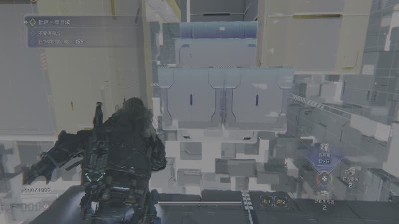
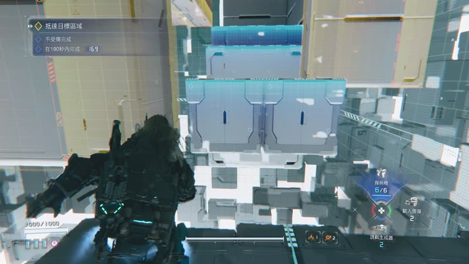

# ps5-washout-fix

> Fix the washed-out colours of PS5 4K HDR `.webm` recordings — for YouTube uploads or local PC playback.

**When does this happen?** Specifically when you have **HDR enabled on the PS5**, record gameplay at **4K**, and then **upload the resulting `.webm` to YouTube** (or play it on a regular PC monitor). The video looks milky, washed out, lifted blacks — nothing like what you saw on your TV. This tool fixes that.


| Before (raw PS5 `.webm`) | After (`ps5video to-sdr`) |
| :---: | :---: |
|  |  |
| Washed out, milky, lifted blacks. | Vibrant, deep blacks, correct UI colours. |

---

## What it does

PS5 records 4K captures as **WebM / VP9 / 10-bit / BT.2020 / PQ (SMPTE 2084) / Opus**. Uploaded to YouTube or played on a PC, the colour looks washed out and milky. This tool gives you two clean fixes:

| Command | Output | When to use |
| --- | --- | --- |
| `ps5video remux-hdr` | `*.mkv` (HDR10) | **YouTube uploads.** Zero quality loss — the VP9 stream is copied as-is, only the container and HDR metadata are rewritten. YouTube then does its own (good) SDR fallback for non-HDR viewers. |
| `ps5video to-sdr` | `*.mp4` (BT.709 SDR) | **Local PC playback / sharing.** High-quality tone-mapping via `libplacebo` + `bt.2390` — keeps far more colour than HandBrake's default Hable tonemapper. |

## Why it's needed

HandBrake's BT.709 colourspace filter is the most-recommended fix online, but it still loses colour. Three things go wrong together:

1. **PQ → BT.709 gamma curve conversion** is often misapplied (treated as HLG or simple gamma 2.2).
2. **Full-Range vs Limited-Range** colour gets mishandled, lifting blacks into a milky grey.
3. **Tone mapping algorithm.** HandBrake's default `hable` sacrifices saturation to preserve highlight detail.

This tool addresses all three: it auto-detects the source's actual colour range (PS5 captures can be either `tv` or `pc` depending on firmware/game), uses `libplacebo` with the ITU `bt.2390` algorithm for tone mapping, and writes correct HDR10 container metadata so YouTube recognises the file as HDR.

## Quick start (Windows)

Requirements:

- [Miniconda](https://docs.conda.io/projects/miniconda/) or Anaconda
- [7-Zip](https://www.7-zip.org/)

```powershell
git clone https://github.com/afk13e43/ps5-washout-fix.git
cd ps5-washout-fix
.\scripts\setup_env.ps1
conda activate ps5video
```

The setup script creates a `ps5video` conda environment with Python 3.12, downloads gyan.dev's static "release-full" FFmpeg build (which includes `libplacebo`), copies it into the env, and installs the CLI in editable mode. About 5 minutes; one-time.

> Note: the script **skips** `conda install ffmpeg` because conda-forge's Windows FFmpeg does not ship `libplacebo`, and its `librsvg` post-link script also crashes on Chinese-locale Windows. The gyan.dev static build sidesteps both problems.

## Usage

The CLI uses a folder convention: drop `.webm` files into `./src_input/`, converted files land in `./src_output/`. Explicit paths still work too.

```powershell
# Inspect what the file actually is
ps5video probe input.webm

# Path A: HDR-preserving remux for YouTube
ps5video remux-hdr input.webm                       # -> ./src_output/input_hdr.mkv
ps5video remux-hdr input.webm -o D:\elsewhere\x.mkv # explicit path also works

# Path B: high-quality SDR conversion for PC
ps5video to-sdr input.webm                          # -> ./src_output/input_sdr.mp4
ps5video to-sdr input.webm --quick                  # faster, slightly lower quality
ps5video to-sdr input.webm --tonemap spline --npl 1000

# Both at once
ps5video both input.webm

# Batch everything in ./src_input
ps5video batch                                      # mode defaults to "both"
ps5video batch --mode remux-hdr
ps5video batch D:\Captures --mode both              # or scan a different folder

# Where is FFmpeg coming from, and does libplacebo work?
ps5video --version
```

## Try it with the bundled sample

A 10-second 4K HDR clip from a PS5 capture is included at [`docs/sample.webm`](docs/sample.webm) (≈62 MB) so you can verify the toolchain end-to-end before recording your own footage.

```powershell
# After setup
cp docs/sample.webm src_input/
ps5video both sample.webm
# Outputs: src_output/sample_hdr.mkv  +  src_output/sample_sdr.mp4
```

## How to verify it worked

1. `ps5video probe input.webm` should report `vp9 / bt2020 / smpte2084`.
2. After `remux-hdr`: open the `.mkv` in MediaInfo and confirm `Transfer characteristics: PQ`, `Color primaries: BT.2020`, and that `mastering_display_metadata` and `content_light_level` are present.
3. After `to-sdr`: play in VLC/mpv on an SDR monitor. Colours should look saturated with deep blacks, not washed out.
4. For YouTube end-to-end: upload the `_hdr.mkv` as an unlisted video. The watch page should display an `HDR` badge once processing finishes.

## Notes & limitations

- **Mastering display metadata defaults to P3-D65 @ 1000 nits.** PS5 captures don't include side_data, so a static default matching how most PS5 games are mastered is used.
- **libplacebo runs on CPU here.** 4K passes are slow (~3 minutes for a 3-minute clip at `--quick`, longer at default quality). Quality is the priority.
- **Audio is downmixed to stereo AAC 192k** — PS5 captures are stereo Opus.
- **Tested on**: Windows 11, conda 26.x, FFmpeg 8.0.x from gyan.dev. Linux/macOS should work with minor setup-script changes but isn't tested.

## Acknowledgements

This project is a thin wrapper around heroic open-source work:

- **[FFmpeg](https://ffmpeg.org/)** (GPL/LGPL) — the conversion engine.
- **[libplacebo](https://github.com/haasn/libplacebo)** (LGPL) — high-quality HDR tone mapping. The `bt.2390` ITU algorithm is what makes the SDR output look right.
- **[gyan.dev FFmpeg builds](https://www.gyan.dev/ffmpeg/builds/)** — the Windows static build that bundles `libplacebo`.
- **[Typer](https://typer.tiangolo.com/)** and **[Rich](https://rich.readthedocs.io/)** (MIT) — CLI and progress UI.

This wrapper's Python code is MIT-licensed (see [LICENSE](LICENSE)). FFmpeg and libplacebo are not redistributed by this repo; the setup script downloads FFmpeg from gyan.dev on the user's machine. Your obligations under FFmpeg's GPL/LGPL terms apply to the binary you install, not to this wrapper.

---

# 中文說明 (Traditional Chinese)

> 修正 PS5 4K HDR `.webm` 錄影的「洗白」問題 — 適用 YouTube 上傳或 PC 本地播放。

**什麼情況會發生這個問題？** 當你 **PS5 開啟 HDR**、用 **4K 錄製遊戲畫面**，再把產生的 `.webm` **上傳到 YouTube**（或在一般 PC 螢幕播放）時，影片會變得霧白、黑位被抬高、整個失去 HDR 在電視上看的層次感。這個工具就是解決這個情況。

## 這是什麼

PS5 錄製的 4K 影片是 **WebM / VP9 / 10-bit / BT.2020 / PQ (SMPTE 2084) / Opus**，上傳到 YouTube 或在 PC 上播放都會「洗白」、顏色變灰白沒層次。這個工具提供兩條乾淨的解法：

| 指令 | 輸出 | 適用場景 |
| --- | --- | --- |
| `ps5video remux-hdr` | `*.mkv` (HDR10) | **上傳 YouTube。** 零畫質損失 — VP9 stream 原封不動複製，只是換容器、補 HDR10 metadata。YouTube 自己會幫 SDR 觀眾做（品質不錯的）tone mapping。 |
| `ps5video to-sdr` | `*.mp4` (BT.709 SDR) | **PC 本地播放/分享。** 用 `libplacebo` + `bt.2390` 演算法做高品質 tone mapping，色彩保留遠優於 HandBrake 預設的 Hable。 |

## 為什麼網路上的 HandBrake 方法效果不夠好

HandBrake 蓋 BT.709 濾鏡是最常被推薦的修法，但仍然會掉色。問題其實是三個一起出現：

1. **PQ → BT.709 gamma 曲線轉換**常常被誤套（當成 HLG 或直接套 gamma 2.2）。
2. **Full Range vs Limited Range** 沒處理好，黑位被抬高就「霧霧的」。
3. **Tone mapping 演算法。** HandBrake 預設用 Hable，為了保 highlight 細節犧牲色彩飽和度。

這個工具同時處理三個：自動偵測來源實際的 color range（PS5 不同韌體/遊戲會輸出 `tv` 或 `pc`）、用 libplacebo 的 ITU `bt.2390` 演算法、且寫入正確的 HDR10 容器 metadata 讓 YouTube 認得。

## 快速開始 (Windows)

需要：[Miniconda](https://docs.conda.io/projects/miniconda/) 或 Anaconda、[7-Zip](https://www.7-zip.org/)。

```powershell
git clone https://github.com/afk13e43/ps5-washout-fix.git
cd ps5-washout-fix
.\scripts\setup_env.ps1
conda activate ps5video
```

Setup 腳本會建立 `ps5video` conda 環境（Python 3.12），下載 gyan.dev 靜態 FFmpeg full build（內含 `libplacebo`），複製進 env，並安裝 CLI。一次性，約 5 分鐘。

> 註：腳本**跳過** `conda install ffmpeg`，因為 conda-forge 的 Windows FFmpeg 沒有 `libplacebo`，且其 `librsvg` post-link script 在中文 Windows 上會 cp950 編碼錯誤崩潰。gyan.dev 的靜態 build 同時解決兩個問題。

## 內建 sample 試用

附了一段 10 秒 4K HDR PS5 錄影在 [`docs/sample.webm`](docs/sample.webm)（約 62 MB），讓你在錄製自己的影片之前就能跑全套流程驗證。

```powershell
cp docs/sample.webm src_input/
ps5video both sample.webm
# 產出: src_output/sample_hdr.mkv  +  src_output/sample_sdr.mp4
```

## 使用範例

預設用資料夾慣例：把 `.webm` 放進 `./src_input/`，轉好的檔案會出現在 `./src_output/`。明確路徑也支援。

```powershell
ps5video probe input.webm                # 看檔案實際 metadata
ps5video remux-hdr input.webm            # 給 YouTube 用
ps5video to-sdr input.webm               # 給 PC 用
ps5video to-sdr input.webm --quick       # 快速模式（畫質略降）
ps5video both input.webm                 # 同時產出兩種
ps5video batch                           # 批次處理 ./src_input 整個資料夾
ps5video --version                       # 確認 ffmpeg 路徑與 libplacebo 狀態
```

## 注意事項

- Mastering display metadata 用 P3-D65 @ 1000 nits 為預設（多數 PS5 遊戲的 mastering）。
- libplacebo 走 CPU，4K 約 1:1 倍速處理時間。預設追求品質。
- 音訊轉成立體聲 AAC 192k（PS5 本來就是立體聲 Opus）。
- 測試平台：Windows 11、conda 26.x、FFmpeg 8.0.x (gyan.dev)。Linux/macOS 理論可用但未測。

## 授權

本專案 Python wrapper 採用 MIT 授權（見 [LICENSE](LICENSE)）。FFmpeg / libplacebo 不在本 repo 內重新發佈，由 setup script 在使用者本機下載；其 GPL/LGPL 條款適用於你安裝的 binary，不適用於這個 wrapper。
